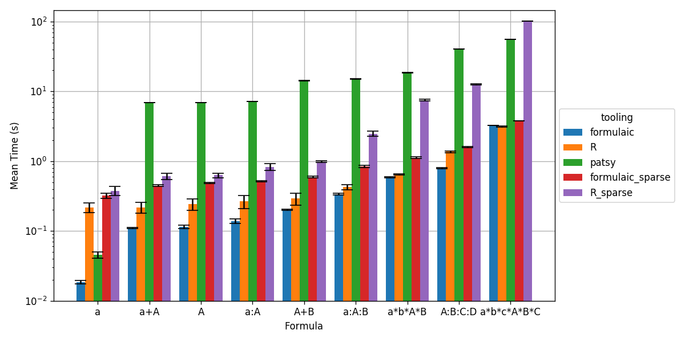

# Formulaic Benchmarks

These benchmarks compare the performance of `formulaic` against the existing
formula parsers for Python ([`patsy`](https://patsy.readthedocs.io/)) and R
([`model.matrix`](https://www.rdocumentation.org/packages/stats/versions/3.6.1/topics/model.matrix)
/
[`sparse.model.matrix`](https://www.rdocumentation.org/packages/Matrix/versions/1.2-17/topics/sparse.model.matrix)) when interpreting Wilkinson formulas and
generating the appropriate model matrices. These benchmarks are somewhat
synthetic, and target large data sizes where performance is more critical. As
such, all of the formula-to-model-matrix transforms are tested on a data frame
with three million rows represented as a Pandas or R dataframe. For the time
being, only CPU performance (as compared to memory utilization) is considered.

To run these benchmarks, install `formulaic` and the benchmarking dependencies using `pip install formulaic[benchmarks]` and then run in a checked out copy of this repository:
```
python <formulaic_repo>/benchmarks/benchmark.py
```

**Note:** This will not install R or the required R dependency `Matrix`. This
benchmark will gracefully skip R benchmarks if these are not found.

You can run the standard visualization code using:
```
python <formulaic_repo>/benchmarks/plot.py
```

## Results

On a ThinkPad T14s Gen 1 with an Intel(R) Core(TM) i7-10610U CPU @ 1.80GHz and 32 GB of DDR4
RAM, this benchmark yields the following results:



```
version information
    python: 3.9.10 | packaged by conda-forge | (main, Feb  1 2022, 21:24:11)
        formulaic: 0.3.0
        patsy: 0.5.2
        pandas: 1.4.1
    R: R version 4.0.5 (2021-03-31) -- "Shake and Throw"
        model.matrix: (inbuilt into R)
        Matrix (sparse.model.matrix): 1.4.0

a
    patsy: 0.0624±0.0054 (mean of 7)
    formulaic: 0.0161±0.0033 (mean of 7)
    formulaic_sparse: 0.326±0.016 (mean of 7)
    R: 0.287±0.041 (mean of 7)
    R_sparse: 0.38±0.11 (mean of 7)
A
    patsy: 5.08±0.22 (mean of 5)
    formulaic: 0.2096±0.0065 (mean of 7)
    formulaic_sparse: 0.497±0.014 (mean of 7)
    R: 0.271±0.048 (mean of 7)
    R_sparse: 0.620±0.047 (mean of 7)
a+A
    patsy: 5.37±0.25 (mean of 4)
    formulaic: 0.2144±0.0050 (mean of 7)
    formulaic_sparse: 0.592±0.011 (mean of 7)
    R: 0.339±0.051 (mean of 7)
    R_sparse: 0.843±0.054 (mean of 7)
a:A
    patsy: 5.42±0.20 (mean of 4)
    formulaic: 0.2448±0.0098 (mean of 7)
    formulaic_sparse: 0.595±0.016 (mean of 7)
    R: 0.325±0.053 (mean of 7)
    R_sparse: 0.629±0.052 (mean of 7)
A+B
    patsy: 10.59±0.36 (mean of 2)
    formulaic: 0.3979±0.0042 (mean of 7)
    formulaic_sparse: 0.7370±0.0056 (mean of 7)
    R: 0.458±0.046 (mean of 7)
    R_sparse: 1.129±0.073 (mean of 7)
a:A:B
    patsy: 13.14±0.74 (mean of 2)
    formulaic: 0.530±0.029 (mean of 7)
    formulaic_sparse: 0.950±0.017 (mean of 7)
    R: 0.512±0.059 (mean of 7)
    R_sparse: 2.44±0.16 (mean of 7)
A:B:C:D
    patsy: 33.971909284591675±0 (mean of 1)
    formulaic: 1.400±0.013 (mean of 7)
    formulaic_sparse: 2.664±0.059 (mean of 7)
    R: 1.574±0.043 (mean of 7)
    R_sparse: 11.207±0.072 (mean of 2)
a*b*A*B
    patsy: 14.136±0.024 (mean of 2)
    formulaic: 0.702±0.016 (mean of 7)
    formulaic_sparse: 1.2937±0.0088 (mean of 7)
    R: 0.744±0.078 (mean of 7)
    R_sparse: 8.047±0.099 (mean of 3)
a*b*c*A*B*C
    patsy: 52.30743145942688±0 (mean of 1)
    formulaic: 3.124±0.016 (mean of 7)
    formulaic_sparse: 4.723±0.058 (mean of 5)
    R: 3.261±0.034 (mean of 7)
    R_sparse: 96.12985253334045±0 (mean of 1)
```
